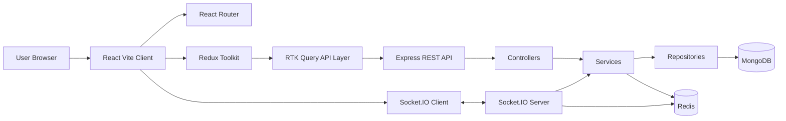
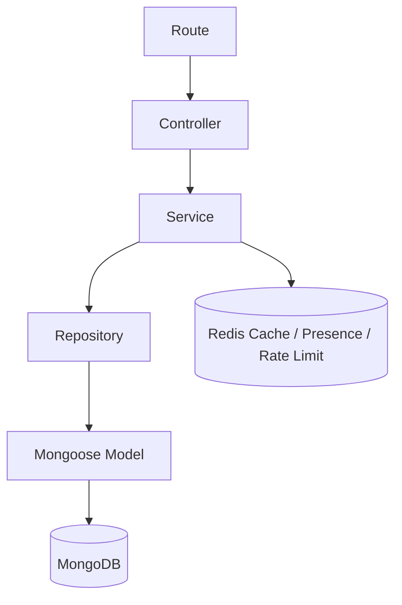
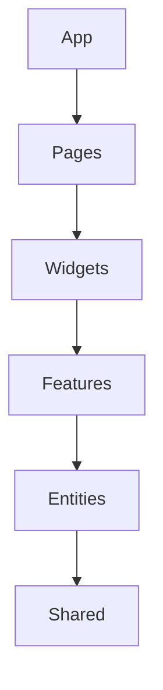
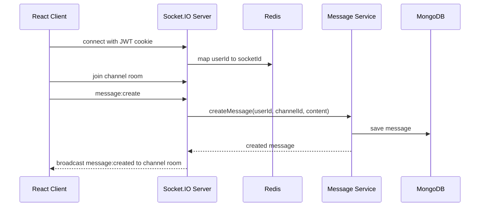
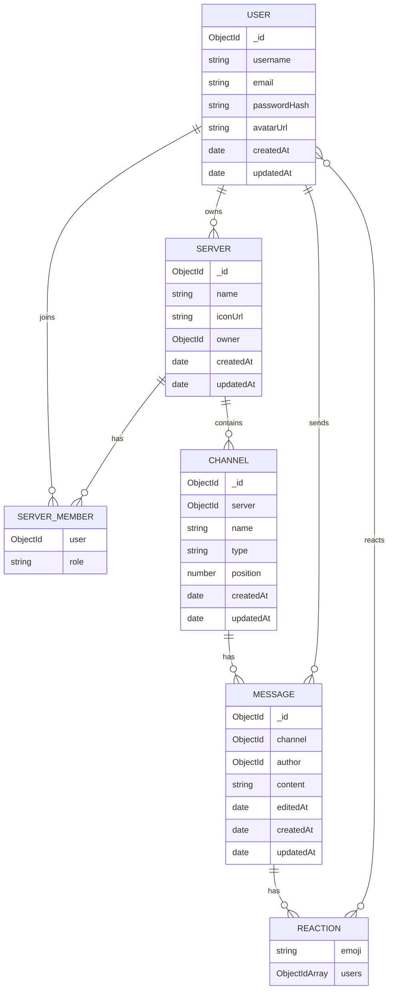

# TribeTalk

Discord-inspired MERN chat app built with JavaScript ES Modules.

## Run locally

1. Install dependencies:

```bash
npm install
```

2. Create `server/.env` from `server/.env.example`.

3. Make sure MongoDB and Redis are running locally, or update the connection URLs in `server/.env`.

4. Start both apps:

```bash
npm run dev
```

Client: http://localhost:5173  
Server: http://localhost:5000

Health check includes Redis status:

```bash
curl http://localhost:5000/health
```

## Architecture

Backend follows:

```txt
routes -> controllers -> services -> repositories -> models
```

Frontend follows:

```txt
App -> Pages -> Widgets -> Features -> Entities -> Shared
```

## Software Architecture

TribeTalk uses a layered MERN architecture designed to keep business rules, database access, and UI state clearly separated.

### High-Level System



### Backend Request Flow



Responsibilities:

- Routes define API endpoints and attach middleware.
- Controllers read request data and send responses.
- Services contain validation, permissions, and business rules.
- Repositories contain database queries only.
- Models define MongoDB schemas only.
- Redis handles temporary distributed state, not permanent records.

### Frontend Structure



Responsibilities:

- Pages represent route-level screens.
- Widgets compose larger UI regions such as sidebars and chat area.
- Features own user actions like auth, creating servers, and creating channels.
- Entities own domain API slices for servers, channels, and messages.
- Shared contains reusable UI, API clients, routing helpers, sockets, and utilities.

### Realtime Architecture



Socket.IO is used only for realtime behavior:

- New messages
- Typing indicators
- Presence updates
- Notifications later

REST is still used for initial data loading:

- Authentication
- Server list
- Channel list
- Message history

## Redis Usage

Redis is used for API rate limiting, short-lived server/channel cache entries, Socket.IO scaling through the Redis adapter, and online presence socket mapping.

## Entity Relationship Diagram



## Interview Talking Points

- The backend follows strict layered architecture to prevent controllers from becoming business-logic files.
- JWT is stored in HttpOnly cookies to reduce token exposure in browser JavaScript.
- RTK Query is the primary API layer, while Axios is only used as the configured HTTP client.
- Socket.IO handles realtime events, but REST handles initial data loading and pagination.
- Redis supports distributed concerns: presence, socket scaling, cache, and rate limiting.
- MongoDB remains the source of truth for users, servers, channels, and messages.
- RBAC lives in the service layer so every entry point enforces the same permissions.
- The frontend avoids prop drilling by storing app-level selections in Redux.
